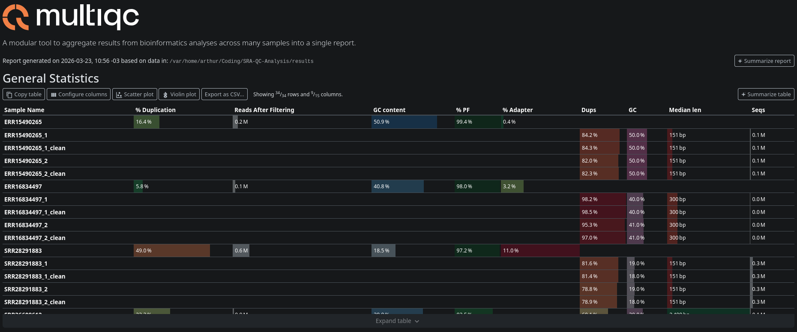

# SRA-QC-Analysis Pipeline


An automated and modular **Python pipeline** for reproducible Quality Control (QC) and preprocessing of Illumina sequencing data (Single-end & Paired-end), downloaded directly from the Sequence Read Archive (SRA).

## 1. Features

- **Automated Download:** Fetches raw data using `prefetch` and decompress with `fasterq-dump` (SRA Toolkit).
- **Quality Control:** Generates pre-trimming QC reports using `FastQC`.
- **Trimming & Filtering:** Cleans reads (adapters, low quality) using `fastp`.
- **Post-Trim QC:** Generates post-trimming QC reports.
- **Aggregation:** Compiles a final interactive HTML report using `MultiQC`.
- **Modular Design:** Easy to maintain and extend Python architecture.


## 2. Installation

### Prerequisites
- **Conda** or **Mamba** (Recommended for faster environment solving).
- **Git**


### 2.1 Setup

1. Clone the repository:
   ```bash
   git clone https://github.com/badecisions/SRA-QC-Analysis.git
   cd SRA-QC-Analysis
   ```

2. Create and activate the environment:
   ```bash
   # Create the environment from the provided file
   conda env create -f environment.yaml

   # Activate it
   conda activate sra_qc
   ```
   *(Note: Ensure your environment file is named `environment.yaml`. If it is named differently, adjust the command above).*


## 3. Usage

The pipeline is executed via the `main.py` script. You can process multiple SRA IDs in a single run.

```bash
python main.py --sra <SRA_ID_1> <SRA_ID_2> ... [OPTIONS]
```

```bash
python main.py -f ID_list.txt ... [OPTIONS]
```


### 3.1 Arguments

| Argument    | Short | Description                                     |  Default   |
| :---------- | :---- | :---------------------------------------------- | :--------: |
| `--sra`     |    -  | List of SRA Accession IDs (e.g., `SRR123456`)   |     -      |
| `--file`    |  `-f` | File .txt with SRA Accession IDs (one per line) |     -      |
| `--outdir`  |  `-o` | Directory for outputs files                     | `results/` |
| `--help`    |  `-h` | Show help message                               |     -      |
| `--threads` |  `-t` | Specifies the number of threads used            |     4      |
| `--data`    |  `-d` | Directory for Raw and Processed data            |  `data/`   |


### 3.2 Examples


**3.2.1 Basic Run (Single Sample):**
```bash
python main.py --sra SRR1153403
```


**3.2.2 Multi-Sample Run (Paired-end supported automatically):**
```bash
python main.py --sra SRR1153403 SRR1234567 --outdir my_analysis_2026
```


**3.2.3 Reading a list of IDs from a file**
```bash
python main.py --file sra_ids.txt
```


## 4. Output Structure

The pipeline organizes files into a clean directory structure:

```text
results/
├── 01_fastqc_raw/        # FastQC reports for raw data
├── 02_fastp_report/      # Fastp reports
├── 03_fastqc_clean/      # FastQC reports for trimmed data
└── 04_multiqc/           # Aggregated MultiQC report (HTML)

data/
├── raw/                  # Raw .fastq files downloaded from SRA
└── processed/            # Cleaned .fq.gz files (output from fastp)

logs/
├── run_datetime.log      # Log of the pipeline execution
├── ID_fasterq-dump.log   # Log from Fasterq-dump (one per ID)
└── ID_fastp.log          # Log from Fastp (one per ID)
```

## 5. Tests

The pipeline includes an automated test suite covering the core modules.

### Running the tests
```bash
# Activate the environment first
conda activate sra_qc

# Run all tests from the project root
pytest tests/ -v
```

### Test coverage

| Module | Tests | Coverage |
|---|---|---|
| `verify_id.py` | 6 | ID validation, regex, sys.exit |
| `recebe_input.py` | 6 | CLI input, file reading, deduplication |
| `check_layout.py` | 4 | Paired/single-end detection |
| `downloader.py` | 4 | Download, failures, missing tools |
| **Total** | **20** | |


## 6. Example Output

### Execution log
```
2026-03-23 10:52:13 - utils.conda_verify - INFO - CONDA: Instalação encontrada!
2026-03-23 10:52:15 - modules.downloader - INFO - Prefetch: Processando o ID SRR28291883
2026-03-23 10:52:15 - modules.downloader - INFO - Comando utilizado: prefetch -O data/raw -v SRR28291883
2026-03-23 10:52:33 - modules.downloader - INFO - Prefetch: SRR28291883 concluído
2026-03-23 10:54:07 - __main__ - INFO - Iniciando descompressão dos SRAs
2026-03-23 10:54:07 - modules.downloader - INFO - Fasterq-dump: Processando o ID data/raw/SRR28291883/SRR28291883.sra
2026-03-23 10:54:07 - modules.downloader - INFO - Comando utilizado: fasterq-dump -O data/raw -x -e 4 data/raw/SRR28291883/SRR28291883.sra
2026-03-23 10:54:09 - modules.downloader - INFO - Fasterq-dump: SRR28291883 concluído
2026-03-23 10:56:48 - __main__ - INFO - Compilando os relatórios com o MultiQC
2026-03-23 10:56:48 - modules.multiqc - INFO - MultiQC: Comando multiqc results -o results/04_multiqc
```

### MultiQC Report



## License

This project is licensed under the MIT License - see the LICENSE file for details.


## Contributions & Support
Contributions and suggestions for new features are welcome, as possibles bug reports.

 To these, please create a new issue, including examples and logs when possible. 
 
 And if you want to PR and add some features, or fixing we're welcome to do this.